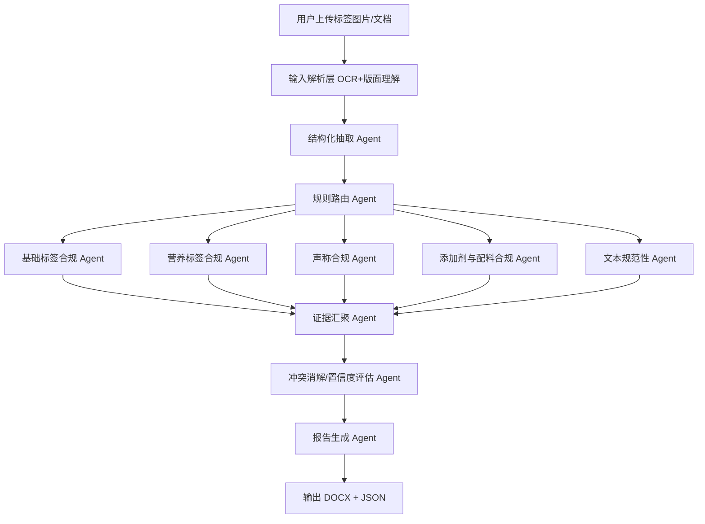

# OpenClaw Skills：食品标签多智能体审核流程

## 1. 目标与范围

### 1.1 目标
构建一个 OpenClaw skill：  
- 输入：用户上传的食品标签图片/文档（可含 OCR 文本）  
- 输出：`docx` 审核分析报告（问题列表 + 依据条款 + 修正建议）  

### 1.2 审核依据
以目录 `C:\Users\wayuj\Desktop\食品标签\data\cleaned` 下文件为准，核心包括：  
- `1.1 GB7718-2025.txt`
- `1.2 《预包装食品标签通则》问答.txt`
- `2.1 GB 28050-2025 食品安全国家标准 预包装食品营养标签通则.txt`
- `2.1《 预包装食品营养标签通则》问答.txt`
- `3.1 食品标识监督管理办法.txt`
- `4.1 GB2760-2024食品添加剂使用标准.txt`

---

## 2. 总体架构（多智能体工作流）



---

## 3. 各智能体职责定义

## 3.1 输入解析层（OCR+版面理解）
- 识别图片中的文本、表格、字段块（产品名称、净含量、配料表、营养成分表、日期等）。
- 输出标准化中间格式 `LabelDocument`（JSON）。

## 3.2 结构化抽取 Agent
- 将 OCR 文本映射为字段：
  - 产品名称、类型、净含量、生产日期、保质期、贮存条件、产地、生产商
  - 配料表、致敏原提示
  - 营养成分表（能量、蛋白质、脂肪、反式脂肪酸、碳水化合物、钠、NRV）
  - 声称信息（如“低糖”“无反式脂肪酸”等）
- 做单位标准化（g/kg, mL/L, kJ/kcal）。

## 3.3 规则路由 Agent
- 根据字段可用性，分发到各审核 Agent：
  - 有营养表 -> 营养标签合规 Agent
  - 有功能/营养声称 -> 声称合规 Agent
  - 有配料表 -> 添加剂与配料合规 Agent
  - 始终执行基础标签和文本规范检查

## 3.4 基础标签合规 Agent
- 审核 `GB7718` 相关必备项及格式：
  - 名称、净含量、生产者信息、日期合法性等
- 示例规则：
  - 净含量 ≥ 1000g 时单位应为 kg（按标准规则库配置）
  - 日期有效性（如 2023-02-29 非法）

## 3.5 营养标签合规 Agent
- 审核 `GB28050`：
  - 项目完整性、单位正确性、数值逻辑一致性、NRV计算
  - 特殊阈值规则（如反式脂肪酸“0”标示条件）
- 可进行复算校验（能量值由三大营养素推导比对）。

## 3.6 声称合规 Agent
- 审核“低糖/低脂/高蛋白”等声称是否合法。
- 从法规知识库检索对应阈值（RAG），并与实际数值比对。
- 输出：`是否合规 + 条款依据 + 证据字段`。

## 3.7 添加剂与配料合规 Agent
- 审核配料命名规范、复配添加剂标注规范。
- 检查“泡打粉”等是否需要拆分为在终产品中具有功能作用的具体添加剂。

## 3.8 文本规范性 Agent
- 识别繁体字、错别字、术语不规范：
  - 如“碳水化物”应为“碳水化合物”
  - 繁体字“見、濃”等提示替换建议
- 中英文呈现规范（如英文名称显著大于中文名称可作为风险项提示）。

## 3.9 证据汇聚 & 冲突消解 Agent
- 合并多 Agent 结果，处理冲突：
  - 同一问题多来源证据 -> 合并为单条 issue
  - 规则冲突时按法规优先级排序
- 产出统一 Issue Schema（见第 5 节）。

## 3.10 报告生成 Agent
- 生成 `docx` 报告：
  - 封面信息
  - 审核摘要
  - 问题清单（编号、严重级、条款、证据、建议）
  - 附录（提取字段快照、计算过程）

---

## 4. 法规知识库与RAG设计

## 4.1 数据准备
- 将 `cleaned` 文本按“条款粒度”切分（优先按“章/条/款”）。
- 每段保留 metadata：
  - `source_file`
  - `standard_name`
  - `chapter`
  - `article`
  - `effective_date`
  - `topic_tags`（如 营养标签/声称/配料）

## 4.2 索引策略
- 向量索引（语义检索）+ 关键词倒排检索（精确召回）混合。
- 检索后 rerank，返回 Top-K 条款证据片段。

## 4.3 引用规范
每个 issue 必须附：
- `依据标准`
- `条款定位`
- `证据原文片段`
- `规则ID`（便于追踪）

---

## 5. 统一输出数据结构（建议）

```json
{
  "document_id": "xxx",
  "product_name": "低糖黄油曲奇饼干",
  "issues": [
    {
      "issue_id": "ISSUE-001",
      "title": "低糖声称不符合阈值",
      "severity": "high",
      "category": "claim_compliance",
      "description": "每100g糖6.5g，不满足低糖条件",
      "evidence": {
        "label_field": "营养成分表-糖",
        "label_value": "6.5g/100g",
        "rule_threshold": "≤5g/100g"
      },
      "standard_refs": [
        {
          "source_file": "2.1 GB 28050-2025 ...txt",
          "article": "相关条款编号",
          "quote": "......"
        }
      ],
      "suggestion": "删除“低糖”声称或调整配方达到阈值后再标示"
    }
  ],
  "summary": {
    "issue_count": 9,
    "high_risk_count": 4
  }
}
```

---

## 6. OpenClaw Skill流程（执行顺序）

1. **接收输入**：图片/文档上传  
2. **OCR与结构化**：输出 `LabelDocument`  
3. **并行审核**：5个审核 Agent 并发执行  
4. **证据检索**：RAG 拉取条款  
5. **结果汇总**：去重、冲突消解、评分  
6. **生成报告**：JSON + DOCX  
7. **返回结果**：下载链接 + 审核摘要  

---

## 7. 质量控制与回归测试

## 7.1 测试集
使用 `test/2 标签来找茬` 中“问题标签+解析”作为基准集。  
- 目标：问题召回率、误报率、条款引用准确率。

## 7.2 指标
- Issue Recall（问题召回率）
- Precision（准确率）
- Evidence Accuracy（条款引用正确率）
- Report Readability（报告可读性）

## 7.3 兜底策略
- OCR置信度低时，输出“待人工复核”标记。
- 规则冲突时保留多意见并标注优先级来源。

---

## 8. 第一阶段落地计划（MVP）

- P0：
  1) OCR+结构化抽取  
  2) 基础标签合规（日期、净含量单位、术语规范）  
  3) 营养表关键规则（低糖、反式脂肪酸、能量复算）  
  4) docx输出  

- P1：
  1) 完整RAG条款引用  
  2) 添加剂规则完善  
  3) 多模型交叉验证与置信度融合

---

## 9. 你给的示例可映射问题（参考）

- 低糖声称不符合阈值  
- 英文名称显著大于中文名称（规范风险项）  
- 净含量单位不规范（1050克应标kg）  
- 含繁体字  
- “泡打粉”标识不规范  
- 日期非法（2023-02-29）  
- 能量值标示错误（需复算）  
- 反式脂肪酸“0”标示阈值问题  
- “碳水化物”应为“碳水化合物”  

> 注：最终以 `cleaned` 目录条款和最新生效版本为准。

